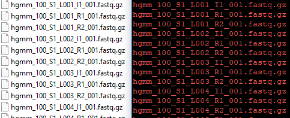
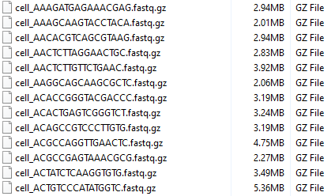
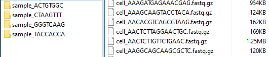

# scSplitter
## Introduction
scSplitter is a preprocessing tool designed to convert scRNA seq results into a format suitable for mutation or SNV calling at the single cell level for the purpose of lineage tracing. The output is incidentally suitable for use with general high-throughput sequencing analysis tools to examine the transcriptome of each individual cell. The main advantage of scRNA seq is that it allows researchers to sequence individual cells, whereas more traditional techniques sequence the aggregate genetic material from a population of cells. However, this means that scRNA seq results contain a mix of reads from perhaps thousands of different cells. scSplitter separates sequencing reads from scRNAseq by their cell of origin and performs preliminary QC using STAR alignment, producing high-quality inputs for finding rare mutations in individual cells.

Researchers interested in the application of scSplitter in a [larger pipeline***](https://github.com/<tl repo>) and other bioinformatics tools can visit Dr. Tao Wang's [lab website](https://qbrc.swmed.edu/labs/wanglab/index.php) for more information. 
## Getting started
### Installation
scSplitter is written in python can be downloaded from [GitHub](https://github.com/zzhu33/scSplitter/blob/master/scSplitter_v0.9.5.zip). 
#### System requirements
scSplitter requires a linux x86-64 operating system with basic utilities (split and gzip; tested on RHEL 6, kernel 3.10.0-693).

Hardware requirements are dependent on reference genome size, CPU, and input size:
  - free drive space: 30x the size of compressed input fastqs, or 3x the size of uncompressed fastqs.
  - CPU: no minimum requirement, but >16 core system with single core performance comparable or better than Intel e5-2680 is   recommended.
  - memory: same as STAR (31 GB + 150 MB per logical processor for human genome index hg38); 64 GB recommended.
### Dependencies
[STAR](https://github.com/alexdobin/STAR) (tested using version 2.6.1b)

python 3.6.4 or 3.7.4
  
**python packages**

numpy, pandas


A STAR reference index is required. Refer to the [STAR manual](https://github.com/alexdobin/STAR/blob/master/doc/STARmanual.pdf) for instructions on generating a genome index.

## Tutorial
This tutorial will guide the user in processing a sample scRNA seq result from 10x Genomic. 
### Inputs
The example inputs are [sample fastqs](http://cf.10xgenomics.com/samples/cell-exp/1.2.0/hgmm_100/hgmm_100_fastqs.tar) from 10x Genomics. The tarball needs to be extracted, although the individual files can be left as .fastq.gz files, or extracted fully as .fastq files. These files should appears similar to those shown in Fig.1. In this example, these input fastqs are placed in `/home/scSplitter_testing/fastqs`.

**Fig.1:** Input fastq files.



Note that since scSplitter is desinged to be easily integrated into other pipelines, filenames of inputs need to be stored in a tab-delimited text file, the included [input text file](https://github.com/zzhu33/scSplitter/blob/master/exampleInputNames.txt) is `exampleInputNames.txt`. The format of the input file is as follows:
```
lane1_read1.fastq  lane1_read2.fastq  lane1_indexRead1.fastq
lane2_read1.fastq  lane2_read2.fastq  lane2_indexRead1.fastq
...
```

The example reference genome is the [human GRCh38](https://www.ncbi.nlm.nih.gov/assembly/GCF_000001405.26/) index. Users can use the following STAR command to generate the index. Refer to the [STAR manual](https://github.com/alexdobin/STAR/blob/master/doc/STARmanual.pdf) for more details.
```
STAR --runThreadN <logical cores> --runMode genomeGenerate --genomeDir <output path> --genomeFastaFiles <input fasta paths> --sjdbGTFfile <annotation files path> -- sjdbOverhang <readLength - 1>
```
In the example, the index is placed in `/home/STAR_indices/hg38/STAR`, other reference genomes such as mm10 can also be used.
### Running scSplitter
Usage:
```
python3 scSplitter.py [options]* --f <input_file> --i <input_directory> --r <output_directory> --ind <STAR_index_directory_path>
```
notes: 
  - syntax is not strictly enforced and inputs can be in any order that is suitable to the user.

**Example run:**

command:
```
$home/scSplitter python3 scSplitter.py --ig True --f exampleInputNames.txt --i /home/scSplitter_testing/fastqs --r /home/scSplitter_testing/test_run --ind /home/STAR_indices/hg38/STAR
```
The example run should take 4-10 minutes, depending on system hardware.

### Results
Results will be written to `/home/scSplitter_testing/test_run/results` along with intermediate files. However, all intermediate files will be deleted to save space. Therefore, although scSplitter may require a large amount of free disk space in order to store these temporary files, the final results are almost invariably smaller than the input. If the output directory does not exist, it will be automatically created. A log, `summary.txt`, is also provided, which includes run parameters and run times, as well as other information about the run. 

**Fig.2** Output fastq files



The output consists of a number of fastq files in the `/results` directory, each one representing reads from one cell (Fig.2). The results are compressed by default and `--gz False` can be used to obtain uncompressed results with a small performance gain. Note that `--ig True` is used to force scSplitter to consider all reads to be from the same sample. Alternatively, the user can simply omit the I1 read names from the `exampleInputFilenames.txt` input file. This option is especially useful in cases where I1 reads are not available. Otherwise, for the example data, scSplitter will create four subdirectories in the output `/results` directory (Fig.3, left), each with a different sample index and contains close to 100 cells (Fig.3, right). The explanation is that 10x Genomics always includes [four different oligos for sample index reads](https://kb.10xgenomics.com/hc/en-us/articles/218168503-What-oligos-are-in-my-sample-index-) in runs with only one sample, therefore there are only ~100 valid cells present (see 10x's [summary](http://cf.10xgenomics.com/samples/cell-exp/1.2.0/hgmm_100/hgmm_100_web_summary.html)). 

**Fig.3** Output fastq files if not using `--ig True`



The summary log indicates that 82.31% of aligned reads were selected. This means that reads with the same cell and UMI barcodes but diferrent sample indeces largely aligned to the same positions. In this case, it appears safe to pool reads from different sample indices. Conversely, if only a small fraction of aligned reads were selected, it may be a sign that multiple samples are present and the sample index should not be ignored. For runs containing multiple samples, I1 reads must be provided and the `--ig` option must be left at the default `True` value to demultiplex the different samples.

It may seem odd that only 58.48% of reads aligned successfully. However, this sample data is a mix of mouse and human cells, and this tutorial only aligned to a human reference genome. When using the mouse mm10 reference index, 44.37% of the reads aligned to the genome. Note that there is overlap due to similarities between the mouse and human genomes. scSplitter currently only aligns to one genome for each run. 


